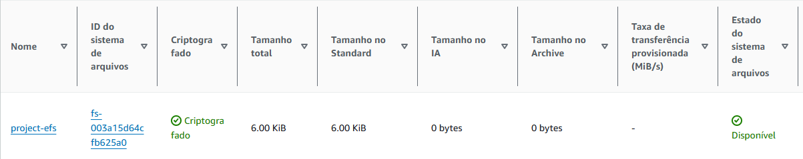

## Documentação da Atividade AWS - Docker 

### **1. Introdução**

Esta documentação detalha o processo de configuração para o deploy de uma aplicação WordPress utilizando **Docker** em instância **EC2** na AWS. O objetivo é consolidar conhecimentos em **DevSecOps**, boas práticas de utilização de containers, e planejamento da infraestrutura.

---

### **2. Planejamento e Configuração da VPC**
  

#### **2.1. Criação da VPC**

- **Bloco CIDR:** `10.0.0.0/16`
- **Sub-redes:**
  - **Públicas:**
    - `10.0.1.0/24` (us-east-1a)
    - `10.0.2.0/24` (us-east-1b)
  - **Privadas:**
    - `10.0.3.0/24` (us-east-1a)
    - `10.0.4.0/24` (us-east-1b)

#### **2.2. Configuração dos Gateways e Tabelas de Rotas**

- **Internet Gateway:** Associado à VPC para permitir o acesso externo às sub-redes públicas.
- **NAT Gateway:**
  - Criado em uma sub-rede pública.
  - Associado a um IP Elástico (Elastic IP).
  - Usado para permitir que as sub-redes privadas acessem a internet de forma controlada.
- **Tabelas de Rotas:**
  - **Sub-redes públicas:** Configuradas para rotear tráfego para o Internet Gateway.
  - **Sub-redes privadas:** Configuradas para rotear tráfego para o NAT Gateway.

---

### **3. Configuração Inicial dos Security Groups**

#### **3.1. Bastion Host**

- **Inbound:**
  - Porta **22 (SSH):** Permitir acesso apenas do IP público do administrador.
- **Outbound:**
  - Todo o tráfego permitido.

#### **3.2. EFS**
  

- **Inbound:**
  - Porta **2049 (NFS):** Permitir acesso apenas dos Security Groups das instâncias EC2 privadas.
- **Outbound:**
  - Todo o tráfego permitido.

#### **3.3. RDS**

- **Inbound:**
  - Porta **3306 (MySQL/Aurora):** Permitir acesso apenas dos Security Groups das instâncias EC2 privadas.
- **Outbound:**
  - Todo o tráfego permitido.

#### **3.4. Load Balancer**

- **Inbound:**
  - Porta **80 (HTTP):** Permitir acesso de qualquer origem (`0.0.0.0/0`).
  - Porta **443 (HTTPS):** Permitir acesso de qualquer origem (`0.0.0.0/0`).
- **Outbound:**
  - Todo o tráfego permitido para as instâncias EC2 privadas.

---


### **4. Configuração do EFS**

#### **4.1. Elastic File System (EFS)**
- Criado para armazenar arquivos estáticos do WordPress e garantir consistência entre instâncias.

#### **4.2. Configuração dos Mount Targets**
- **Sub-redes privadas:**
  - `10.0.3.0/24` (us-east-1a)
  - `10.0.4.0/24` (us-east-1b)
- **Segurança:** Associado ao Security Group do EFS para controlar acesso.

#### **4.3. Montagem nas EC2**
- Diretório de montagem: `/mnt/efs`
- Comandos:
  ```bash
  sudo mkdir -p /mnt/efs
  sudo mount -t nfs4 -o nfsvers=4.1,rsize=1048576,wsize=1048576,hard,timeo=600,retrans=2,noresvport <EFS_ID>.efs.<REGION>.amazonaws.com:/ /mnt/efs

### **5. Configuração do Banco de Dados RDS**

#### **5.1. Configurações do RDS MySQL**
- **Tipo de Instância:** `db.t3.micro`
- **Armazenamento:** 20 GiB (General Purpose SSD)
- **Backup:** Retenção de 7 dias
- **Subnet Group:** Associado às sub-redes privadas `10.0.3.0/24` e `10.0.4.0/24`
- **Sem Acesso Público:** Configurado para operar exclusivamente em sub-redes privadas

#### **5.2. Configuração de Segurança**
- **Inbound:**
  - Porta **3306 (MySQL/Aurora):** Permitir acesso apenas dos Security Groups das EC2 privadas.

#### **5.3. Conexão ao RDS**
- **Endpoint:** Usado no arquivo `docker-compose.yml`:
  ```yaml
  environment:
    WORDPRESS_DB_HOST: <RDS_ENDPOINT>
    WORDPRESS_DB_USER: <DB_USER>
    WORDPRESS_DB_PASSWORD: <DB_PASSWORD>
    WORDPRESS_DB_NAME: <DB_NAME>


### **6. Configuração do Load Balancer**

#### **6.1. Classic Load Balancer**
- **Tipo:** Classic Load Balancer
- **Listeners:**
  - HTTP (`80`)
  - HTTPS (`443`)
- **Health Checks:**
  - Intervalo de checagem: 30 segundos
  - Threshold de sucesso: 2 checagens consecutivas
  - Timeout: 5 segundos
  - Caminho: `/`

#### **6.2. Sub-redes**
- Associado às sub-redes públicas `10.0.1.0/24` e `10.0.2.0/24`

#### **6.3. Configuração de Segurança**
- **Inbound:**
  - Porta **80 (HTTP):** Permitir acesso de qualquer origem (`0.0.0.0/0`)
  - Porta **443 (HTTPS):** Permitir acesso de qualquer origem (`0.0.0.0/0`)
- **Outbound:**
  - Todo o tráfego permitido para as instâncias EC2 privadas.

#### **7. Configuração das Instâncias EC2**

#### **7.1 Criar instâncias EC2 privadas para hospedar a aplicação WordPress.**
- Associar as instâncias às sub-redes privadas configuradas anteriormente.
- Configurar o **User Data** para automatizar a instalação do Docker, Docker Compose e o deploy do WordPress:
  ```bash
  #!/bin/bash
  sudo yum update -y
  sudo yum install -y docker
  sudo systemctl start docker
  sudo systemctl enable docker
  sudo usermod -aG docker ec2-user
  sudo curl -L https://github.com/docker/compose/releases/download/v2.17.3/docker-compose-$(uname -s)-$(uname -m) -o /usr/local/bin/docker-compose
  sudo chmod +x /usr/local/bin/docker-compose
  sudo mkdir /app
  cat <<EOF > /app/docker-compose.yml
  version: '3.3'
  services:
    wordpress:
      image: wordpress
      restart: always
      ports:
        - 80:80
      environment:
        WORDPRESS_DB_HOST: <RDS_ENDPOINT>
        WORDPRESS_DB_USER: <DB_USER>
        WORDPRESS_DB_PASSWORD: <DB_PASSWORD>
        WORDPRESS_DB_NAME: <DB_NAME>
      volumes:
        - /mnt/efs:/var/www/html
  EOF
  cd /app
  sudo docker-compose up -d


#### **7.2. Deploy do WordPress**

- Validar a conectividade entre as instâncias EC2, o banco de dados RDS e o EFS.
- Configurar o DNS do Load Balancer para apontar para as instâncias EC2 privadas.
- Acessar a aplicação WordPress pelo endpoint público do Load Balancer e verificar o funcionamento.

#### **7.3. Testes de Validação**

- Verificar o acesso ao painel administrativo do WordPress.
- Testar a persistência de dados ao realizar upload de arquivos e validar a integridade no EFS.
- Validar a escalabilidade e balanceamento de carga utilizando o Auto Scaling Group e o Load Balancer.


